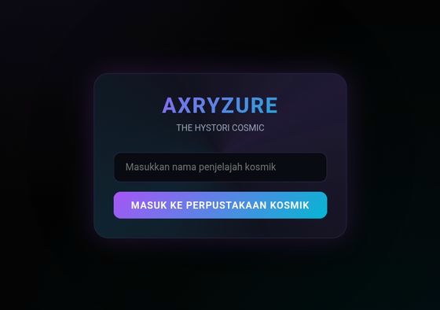
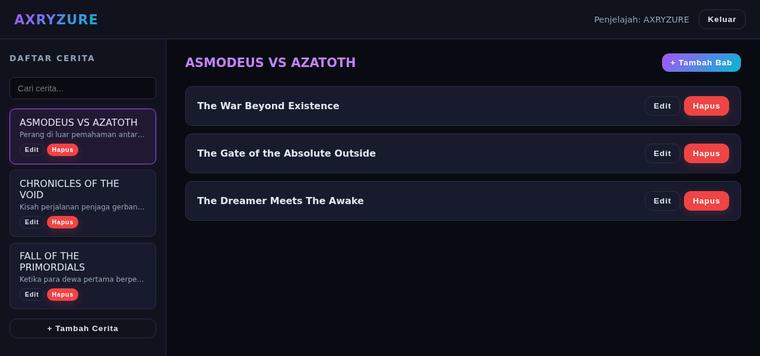

<p align="center">
  
</p>

<p align="center">
  
</p>

<p align="center">
  <a href="https://superrrkyy.github.io/axryzure-hystori-cosmic/">
    
  </a>
</p>

<p align="center">
  
  
  
  
  
</p>

---

> **Perpustakaan cerita kosmik interaktif** berbasis web. Menyimpan kisah-kisah epik tentang pertempuran antar entitas absolut, kehampaan, dan misteri di luar realitas. Kamu bisa **membaca, menambah, mengedit, dan menghapus** cerita beserta bab-babnya langsung di browser.

### 📸 Tampilan

<p align="center">
  
  <br>
  <sub><i>✦ Gerbang masuk: login sebagai penjelajah kosmik</i></sub>
</p>

<p align="center">
  <a href="https://superrrkyy.github.io/axryzure-hystori-cosmic/">
    
  </a>
  <br>
  <sub><i>✦ Daftar cerita & bab. Ketuk gambar untuk membuka website.</i></sub>
</p>

---

### ✨ Fitur

- 🔐 **Login sederhana**: masuk dengan nama penjelajah kosmik
- 📚 **Daftar cerita** lengkap dengan deskripsi singkat
- 🔍 **Pencarian** berdasarkan judul atau deskripsi
- ✍️ **Tambah, edit & hapus cerita**
- 📑 **Manajemen bab**: tambah, edit, dan hapus bab di setiap cerita
- 📖 **Mode baca** yang bersih dan fokus
- 💾 **Tersimpan otomatis** di `localStorage`, tanpa server
- 🌌 **Tema kosmik** gelap dengan gradasi ungu-cyan, responsif di HP & desktop

---

### 📜 Cerita Bawaan

| | Judul | Kisah |
|:-:|:--|:--|
| ⚔️ | **ASMODEUS VS AZATOTH** | Perang di luar pemahaman antara keteraturan dan kekacauan |
| 🕳️ | **CHRONICLES OF THE VOID** | Perjalanan penjaga gerbang kosmik melintasi kehampaan |
| 🔥 | **FALL OF THE PRIMORDIALS** | Kisah perang pertama para dewa pencipta |

Kamu bisa menambahkan cerita baru atau melanjutkan kisah yang sudah ada. ✨

---

### 🧭 Cara Menggunakan

1. Buka 👉 **[superrrkyy.github.io/axryzure-hystori-cosmic](https://superrrkyy.github.io/axryzure-hystori-cosmic/)**
2. **Login** dengan nama apa saja
3. Pilih cerita dari sidebar untuk membaca
4. Ketuk **+ Tambah Cerita** untuk membuat cerita baru
5. Di dalam cerita, ketuk **+ Tambah Bab** untuk melanjutkan kisahnya
6. Setiap cerita dan bab bisa di-**Edit** atau di-**Hapus**

> [!TIP]
> Semua data tersimpan di browser yang kamu pakai. Cerita yang kamu tulis di HP tidak akan muncul di laptop, dan akan hilang jika data browser dihapus.

---

### 💻 Menjalankan Secara Lokal

```bash
git clone https://github.com/superrrkyy/axryzure-hystori-cosmic.git
cd axryzure-hystori-cosmic
```

Lalu buka `index.html` di browser modern (Chrome, Firefox, Edge). Tidak perlu server atau dependensi apa pun.

<details>
<summary><b>📂 Struktur file</b></summary>
<br>

```
axryzure-hystori-cosmic/
├── index.html   # Seluruh aplikasi (HTML + CSS + JS)
├── assets/      # Banner & screenshot README
└── README.md
```

</details>

---

### 🗺️ Rencana Pengembangan

- [ ] Ekspor & impor cerita (file JSON)
- [ ] Mode baca layar penuh
- [ ] Sinkronisasi cloud antar perangkat
- [ ] Ilustrasi untuk setiap cerita

---

<p align="center">
  <i>"Di luar batas realitas, setiap kisah menunggu untuk ditulis."</i>
  <br><br>
  Dibuat dengan 💜 oleh <a href="https://github.com/superrrkyy"><b>AXRYZURE</b></a> • Bebas digunakan untuk pribadi & pembelajaran
</p>
